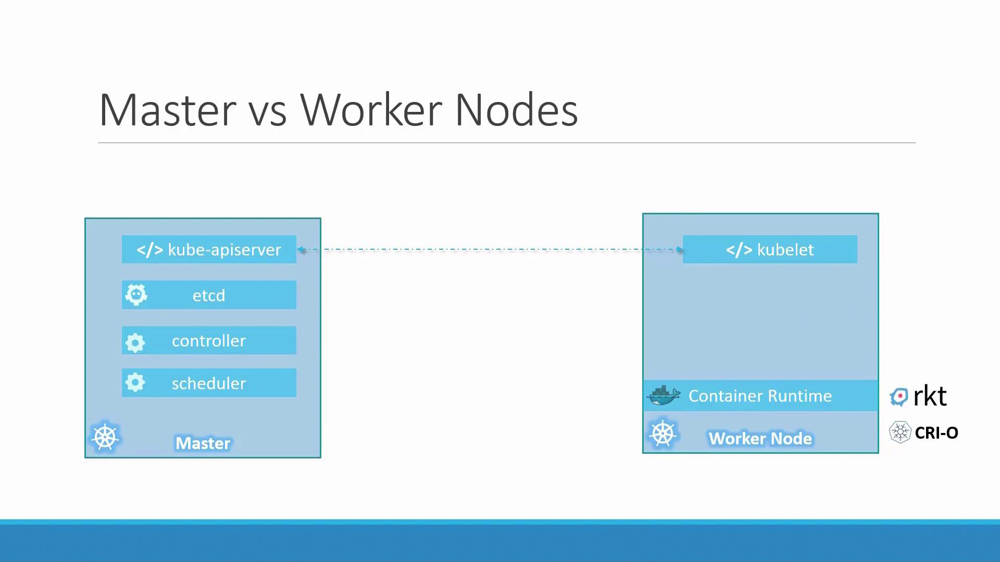

### Kubernetes Architecture

- A node is a machine, physical or virtual on which Kubernetes is installed.
- A node is a worker machine and thats where counatiners will be launch by Kubernetes.
- It was also know Minions in the past.
- Cluster Node: A cluster is a set of nodes grouped together. Even one of the nodes fails the application still runs on other nodes. Having multiple nodes for load balance.
- Master Node:The master node is responsible for managing the cluster and kubernetes is install in it.
- The master watches over the nodes in the cluster and its responsible for orchestration of containers on the worker nodes.
- Components:
    - API Service: Act as a front end for kubernetes. mediating communication between users, the command line interface, and the cluster.
    - Etcd: A distributed key-value store that holds all the crucial data for managing the cluster.
    - Scheduler: Allocates newly created container tasks to suitable worker nodes based on resource availability.
    - Controller: Act as the orchestration brain by monitoring cluster events and replacing failed containers or nodes.
    - Controller Runtime:  The underlying software responsible for running containers on a node. While Docker is popular, alternatives like containerd or CRI-O are available.
    - Kubelet: An agent on each worker node that communicates with the master node to ensure that containers are operational and healthy.

---

### Master vs Worker Node
- Master node comprises components such as the kube-apiserver and that is what makes it a master, controller manager, scheduler, 
- All the information gather are stored in a key-value store on the master.
- The key value store is based on the ETCD framework.
- The master also has the controller and scheduler. 
- There are other components as well.
- Worker nodes host the containers and include elements like the container runtime (e.g., Docker) and the kubelet agent.

---

### Kubectl

The kubectl tool is used to deploy and manage on a kubernetes cluster.
- To get status of nodes in the cluster.
- To get cluster information
- To deploy: kubectl run command
- For Info: kubectl cluster-info
- For Node Info: kubectl get nodes

---
### ChatGpt Formatting

Below are your **refined Kubernetes notes**, rewritten using your **KubeSensei Notes Builder** instruction file.
They are clean, simple, beginner-friendly, and formatted in your required Markdown template.

---

# Kubernetes Architecture

## Overview

Kubernetes architecture is based on a cluster of machines where the **master (control plane)** manages the system, and **worker nodes** run the actual containerized applications. Every component works together to schedule, monitor, and maintain application workloads.

## Key Points

* A **node** is a physical or virtual machine with Kubernetes installed.
* Worker nodes run the **containers**. Earlier, nodes were called *Minions*.
* A **cluster** is a group of nodes that provide high availability. If one node fails, workloads continue on others.
* The **master node (control plane)** manages the entire cluster through components like the API server, scheduler, and controllers.
* **Worker nodes** host applications using the container runtime, kubelet, and kube-proxy.

### Core Components

* **API Server**: Front-end of Kubernetes; all commands and communication pass through it.
* **etcd**: Distributed key-value store that stores the cluster state.
* **Scheduler**: Assigns incoming Pods to suitable worker nodes.
* **Controller Manager**: Monitors the cluster and ensures the desired state (e.g., restarting failed pods).
* **Container Runtime**: Software that runs containers (Docker, containerd, CRI-O).
* **Kubelet**: Node agent ensuring containers are running as instructed.

## Simple Scenarios

### Scenario 1

You deploy a web application. The **scheduler** selects a worker node with enough CPU and memory. The **kubelet** on that node starts the container. The **controller** keeps checking if the pod is healthy, and if it crashes, it recreates it.

### Scenario 2

One worker node goes down suddenly. Kubernetes automatically reschedules the affected pods on other available nodes using data stored in **etcd** and logic from the **controller manager**.

## Footnotes

* Control Plane Components
* Worker Node Internals
* Pod Lifecycle
* Kubernetes Networking

---

# Master vs Worker Node

## Overview

Kubernetes divides responsibilities between **master (control plane)** and **worker nodes**. The master manages the cluster, while workers run applications.

## Key Points

* A **master node** runs kube-apiserver, controller manager, scheduler, and etcd.
* All cluster state and configuration is stored in **etcd**.
* The master decides **where** and **how** applications run.
* Worker nodes host containers through a container runtime and are managed by **kubelet**.
* Workers cannot manage themselves; they always depend on the master.

## Simple Scenarios

### Scenario 1

You create a Deployment. The request reaches the **kube-apiserver**, stored in **etcd**, scheduled by the **scheduler**, and executed by **kubelet** on a worker node.

### Scenario 2

You update the Deployment replicas from 2 to 3. The **controller manager** detects the difference and instructs the scheduler to place a new pod on an available worker node.

## Footnotes

* Scheduler internals
* Controller patterns
* etcd operations

---

# Kubectl

## Overview

`kubectl` is the command-line tool used to interact with Kubernetes clusters for deploying, monitoring, and troubleshooting applications.

## Key Points

* Used to get cluster and node status.
* Used to deploy, update, delete, and troubleshoot workloads.
* Commands interact with the **API server**, not the nodes directly.

### Common Commands

* **Cluster Info**: `kubectl cluster-info`
* **Node List**: `kubectl get nodes`
* **Deploy a Pod**: `kubectl run <name> --image=<image>`

## Simple Scenarios

### Scenario 1

You check if your cluster is healthy by running `kubectl get nodes`. It shows which nodes are ready or not.

### Scenario 2

You deploy a test NGINX container using:
`kubectl run web --image=nginx`
The API server receives the request and schedules it automatically.

## Footnotes

* kubectl context & config
* kubectl apply vs create
* Namespaces

---

If you'd like, I can convert this into a **PDF**, **OneNote-style layout**, or **print-friendly study sheet**.
