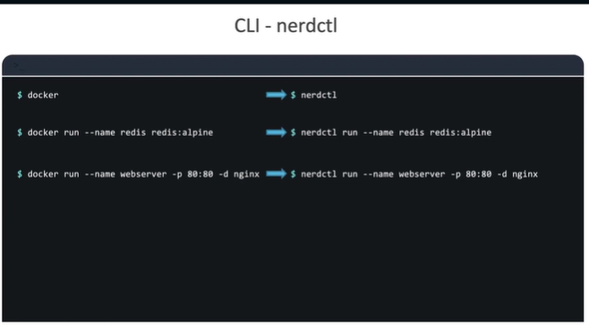
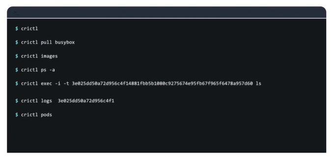

### Docker vs ContainerD

#### Docker
- Docker user experience made working with containers super simple and hence, Docker became the most dominant container tool.
- Kubenetes  was build to  orchestrate Docker specifically In the beginning.
- Docker and Kubernetes were tightly coupled.
- In the beginning Kubenetes only worked with Docker and didn't support any other container solution.
- Kubernetes introduce CRI to work with other containers vendors
- CRI allowed any vendor to work as a container runtime for Kubernetes
- OCI standards needs to be maintain to work as a container runtime
- OCI standas for Open Container Initative.
- OCI consists of Image spec and runtime spec.
- Image Spec: means specification on how an image should be built.
- Runtime Spec: defines the standards on how any conatiner runtime should be developed.
- Docker wasn't build to support the CRI standards.
- Kubenetes introduce what is know as DockerShim.
- Docker isn't a container runtime it consists of multiple tools, Docker CLI, API, build tools, support for volumes, Auth, Security.
- Container runtime called RunC and the deamon that managed Run C was called as ConatinerD.
- DockerShim was remove in version Kubernetes 1.24 completely.

### ContainerD
- CTR command line utility that comes with ContainreD
- ContainerD is a part of Doceker is a seperate project on its own now and a member of CNCF with a graduate status.
- The command line tool comes with ContainerD is CTR.
- The tool is solely made for debugging conatainerD and its not very user friendly.
- It support a limited set of featuers.
- To pull a image ```ctr images pull address of image```
- To run a container ``` ctr run docker address of the image ```

### Nerdctl Tool

- A better alternative recommeded is the nerdctl tool
- Nerdctl tool is a command line tool.
- Nerdctl is very similar to Docker.
- Supports most of the options that Docker supports.
- Supports lazy pulling, p2p image distribution, image signing and verifying, namespace in kubernetes.
- A nerdctl tool works very similar to Docker CLI.
- 


### CRICTL / CRI Control
- This tool is maintained/developed by kubernetes community.
- This tool works across all the different conatiner runtimes.
- This tool is to inspect and debug container runtime.



---

# Docker vs ContainerD

## Overview

Docker initially made containers easy to use, so Kubernetes was tightly integrated with Docker. As Kubernetes evolved, it introduced the Container Runtime Interface (CRI) to support multiple container runtimes—not just Docker. ContainerD later became the primary, CRI-compatible runtime used by Kubernetes.

This note explains how Docker, ContainerD, Nerdctl, and CRICTL relate in the Kubernetes ecosystem.

---

# Docker

## Overview

Docker provided an excellent user experience for building and running containers, which made it extremely popular. Early Kubernetes versions supported only Docker, but Docker was not designed to follow CRI standards. Kubernetes introduced “Dockershim” to bridge this gap, and later removed it in Kubernetes v1.24.

## Key Points

* Docker became the dominant container tool because of its simple user experience.
* Kubernetes originally orchestrated only Docker containers.
* Kubernetes introduced **CRI (Container Runtime Interface)** to support multiple runtimes.
* Any CRI-compatible runtime must follow **OCI (Open Container Initiative)** standards.
* OCI defines:

  * **Image Spec** – how container images should be built.
  * **Runtime Spec** – how container runtimes should operate.
* Docker was not built for CRI; thus Kubernetes created **Dockershim**.
* Dockershim was removed because Kubernetes no longer needed a special integration for Docker once ContainerD became fully CRI-compliant.
* Docker is not just a runtime—it includes CLI, API, build tools, auth, volume support, etc.
* Docker uses:

  * **container runtime:** `runc`
  * **daemon managing runc:** `containerd`
* Dockershim was removed completely in **Kubernetes v1.24**.

## Simple Scenarios

### Scenario 1

You upgrade to Kubernetes 1.24 and see that Docker is no longer detected as a runtime. This is because Kubernetes removed Dockershim, and now expects ContainerD or another CRI-compatible runtime.

### Scenario 2

You build a Docker image locally using `docker build`. Even though Kubernetes no longer integrates Docker directly, the image still works because it follows OCI Image Spec.

## Footnotes

* Container Runtime Interface (CRI)
* OCI specifications
* Dockershim removal

---

# ContainerD

## Overview

ContainerD originated inside Docker but became a separate CNCF project. It is now a full container runtime that natively supports CRI and is commonly used with Kubernetes.

## Key Points

* ContainerD is now an independent CNCF graduate-level project.
* It includes a low-level CLI tool called **ctr**.
* `ctr` is mainly for debugging, not daily use.
* Limited features and not user-friendly.
* Common commands:

  * Pull image: `ctr images pull <image>`
  * Run container: `ctr run docker.io/<image> mycontainer`

## Simple Scenarios

### Scenario 1

You SSH into a Kubernetes node and want to confirm if images were pulled. Using `ctr images ls`, you quickly verify what images ContainerD is managing.

### Scenario 2

A pod is stuck in `ContainerCreating`. You use `ctr tasks ls` to verify whether ContainerD is actually running the container process.

## Footnotes

* runc
* CRI integration
* Kubelet ↔ ContainerD communication

---

# Nerdctl

## Overview

Nerdctl is a Docker-like CLI for ContainerD that offers user-friendly commands, making it ideal for developers who want Docker-style usability with ContainerD.

## Key Points

* CLI tool designed to be Docker-compatible.
* Supports Docker-like commands (`nerdctl run`, `nerdctl build`, etc.).
* Supports advanced features like:

  * Lazy pulling
  * P2P image distribution
  * Image signing and verification
  * Kubernetes-style namespaces
* Makes ContainerD easier to work with compared to `ctr`.

## Simple Scenarios

### Scenario 1

You switch from Docker to ContainerD on a developer machine and continue running `nerdctl run nginx` the same way you used to run `docker run nginx`.

### Scenario 2

You want to build images directly on a node without Docker installed. Using `nerdctl build -t app:v1 .` works the same as Docker’s build command.

## Footnotes

* Docker CLI alternatives
* ContainerD namespace handling
* Image signing technologies

---

# CRICTL (CRI Control)

## Overview

CRICTL is a Kubernetes-maintained tool for interacting with any CRI-compatible runtime, such as ContainerD or CRI-O. It is essential for troubleshooting container issues on Kubernetes nodes.

## Key Points

* Works with all CRI implementations.
* Used for debugging containers at runtime level.
* Shows pod, container, image, and status information.
* Helps diagnose runtime-level failures separate from Kubernetes.

## Simple Scenarios

### Scenario 1

Your pod is failing, and `kubectl describe` doesn’t show enough detail. You run `crictl ps -a` to inspect container-level status directly from the runtime.

### Scenario 2

A node shows image pull issues. Using `crictl images`, you verify what images are already cached in the runtime.

## Footnotes

* Kubelet ↔ CRI communication
* CRI-O
* Kubernetes node troubleshooting

---

If you want the next topic summarized with the same KubeSensei persona, just share it!


---