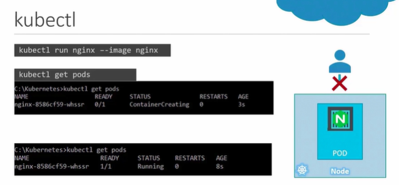

### Pods
- Kubernetes does not deploy containers directly on the worker nodes.
- The containers are encapsulated into a Kubernetes object know as pods.
- A pod is single instance of an applicaiton.
- A pod is the smallest object that you can create in kubernetes.

### Single Node Kubernetes Cluster
- A single instance of the application running in a single Docker container encapsulated in a pod.

##### What if the numbers of users accessing the applciation increase and application needs to scale?
    - We do not bring new container instance within the same pods.
    - We create a new pod altogether with a new instance of the same application.

** Always deploy additional pods on a new node in the cluster if the capacity of user increases.**

- To scale up create new pods, to scale down delete existing pods. Pods usually have a one-to-one relationship with containers running the application.

- Dont add addditional containers to an existing pod to scale the application.

- A single pod can have multiple containers, except for the fact that they ususally not multiple containers of the same kind.

- Multipod containers are a rare use case.

---
### Chatgpt
---

# Pods

### Overview

A **Pod** is the smallest deployable unit in Kubernetes. It encapsulates one (or rarely more) containers that together run a single instance of an application and share networking and storage resources.

### Key Points

* A pod usually contains a **single container** that runs the application process.
* Pods provide **shared networking (IP + ports)** and **shared volumes** to containers inside the pod.
* Pods are **ephemeral** — they can be created, destroyed, and replaced by higher-level controllers (Deployments, ReplicaSets).
* Kubernetes **schedules pods to nodes** — Kubernetes does **not** run containers directly on nodes without the pod abstraction.
* To **scale an application**, create more pods (not more containers inside the same pod). Each pod is a separate instance.
* A pod **can** contain multiple containers when those containers must be tightly coupled (sidecar pattern), but multiple containers of the *same* application inside one pod is not a scaling technique.
* Pods typically have a **one-to-one relationship with the primary container** they host; multi-container pods are a specialised use-case.

### Simple Scenarios

### Scenario 1 — Single-node test app

You run a simple web app on a single-node Kubernetes cluster. You package the app into one container and create a pod for it. That pod exposes the app on port 80 and uses a small persistent volume for logs. The pod is the single running instance of the app.

### Scenario 2 — Scaling for more users

Traffic increases. Instead of adding another container inside the existing pod, you create additional pods (each with one container instance of the app). Kubernetes schedules those pods across available nodes so the load can be balanced. If nodes are unavailable, Kubernetes may schedule new pods on other nodes or leave them pending until capacity exists.

### Footnotes

* Related: Deployments & ReplicaSets (used to manage and scale pods).
* Related: Sidecar containers (when to put multiple containers in one pod).
* Related: Pod lifecycle & readiness/liveness probes.

---