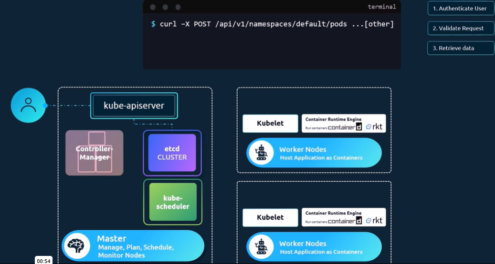

### Kube API
- The kube api is the primary management component in kubernetes
- When you run a command kubectl, the utility is in fact reaching the kube api servicer.

    - The kube api server first authenticates the request and validates it.
    - Then retrives the data from the etcd cluster.

Lets look at an example of creating a pod
directly by sending a POST request.

First the request is authenticated and then validated.

The API server creates a pod object without assigning it to a node updates the information in the ETCD server updates the user that hte pod has been created.

The scheduler continuously monitors the KubeAPI server and realize there is a new pod with no Node assigned.

The scheduler identifies the right node to place the new pod on and communicate that back to the API server.

KubeAPI updates the information to the ETCD Server.

The API server then passes the info to the Kubelet in the appropriate worker node. The kubelet create the pod on the node and update and instruct the container runtime engine to deploy the application image.

Once done the kubelet updates the API server and the API server then updates the data back in the ETCD cluster.

This similar pattern is followed everytime a change is requested.

The KubeAPI server is at the center of all the different tasks that need to be performed to make a change in the cluster.

