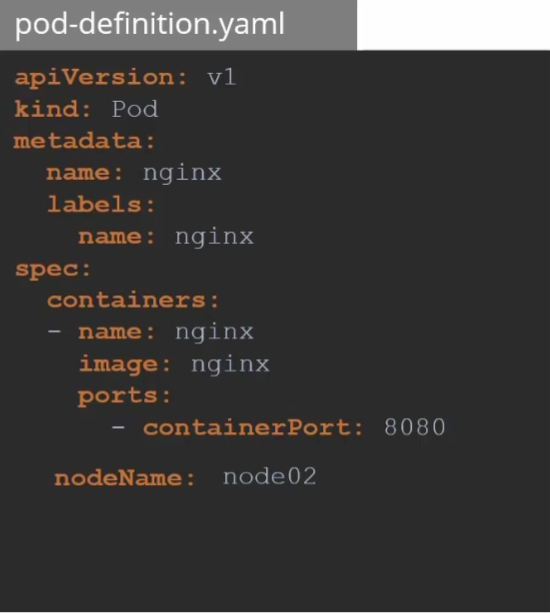
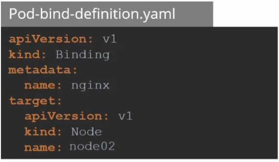

### Manual Scheduling

Ways to manually scheduling a pod on a node.

- Every pod definition/manifest file has a field nodeName which is not set, kubernetes adds it manually.
- The scheduler goes through all the pods and looks for those who do not have the property set.
- The scheduler find the right Node for the Pod by schduling algorithm
- If there is no scheduler to monitor and schdule nodes? The Pod will be on the pending state.
- You can specific the nodeName at creation time.
- If the Pod is already created and to assign the pod to a given Node:Kubernetes wont allow you to modify the nodeName property of a POD.





- Another way to assign a Node to a esisting POD is to create a binding object and send a post request to POD binding API.




-   In the binding object you specfic a target node with the name of the node. Then send the post request to pod binding API with the data set to the binding object in a JSON format


---


### Instruction File
---

# Manual Scheduling in Kubernetes

## Overview

Manual scheduling means assigning a Pod to a specific Node **without relying on the Kubernetes Scheduler**. Normally, the scheduler decides where a Pod should run, but with manual scheduling you directly specify the target node.

## Key Points

* Every Pod manifest includes a field called **`nodeName`**, but it is usually left empty.
* Kubernetes Scheduler checks for Pods **without `nodeName`** and assigns them to suitable nodes.
* If the Scheduler is missing or disabled, Pods will remain in a **Pending** state.
* You can manually schedule by setting **`nodeName`** at Pod creation time.
* After a Pod is created, Kubernetes **does not allow modifying `nodeName`**.
* For already running Pods, you can manually schedule them by creating a **Binding object** and sending a `POST` request to the Pod Binding API.
* In a Binding object, you specify the **target node name**, and send the request with JSON data.

## Simple Scenarios

### Scenario 1

You want a Pod to always run on a node that has GPU. While creating the Pod manifest, you add:

```yaml
nodeName: gpu-worker-1
```

The Pod gets scheduled directly on that specific GPU node without using the scheduler.

### Scenario 2

You created a Pod without specifying a node. The scheduler is down, so it stays in **Pending**.
You create a Binding object:

```json
{
  "apiVersion": "v1",
  "kind": "Binding",
  "metadata": { "name": "mypod" },
  "target": { "apiVersion": "v1", "kind": "Node", "name": "node-2" }
}
```

Then you `POST` it to:

```
/api/v1/namespaces/default/pods/mypod/binding
```

The Pod immediately gets assigned to **node-2**.

## Footnotes

* Scheduler internal workflow
* Taints and Tolerations
* Node selectors vs node affinity
