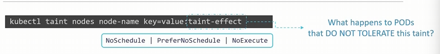
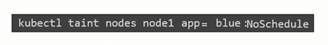
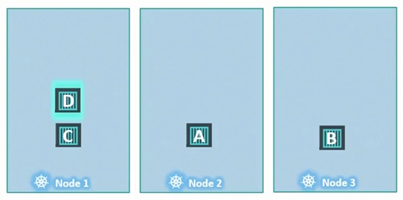
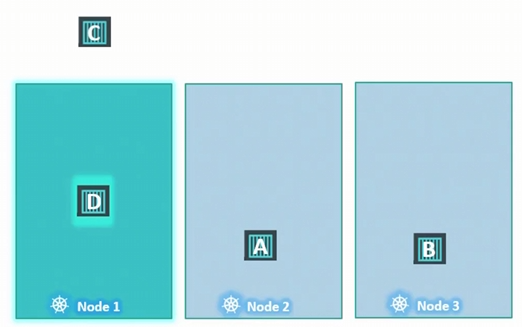

### Taints and Tolerations

#### ANALOGY
- To prevent a bug to land on a person we spray a replicant spray(Taint) on the person. The bug is intolerant to the smell. However ther could be other bug there are tolerant to the spray(taint), so they end up landing on the person.
    - So there are two thing decise that the bug can land on the person.
    - First the taint on the person.
    - Second the bug toleration level to that particular taint.

---

### Taints - Node
In Kubernetes we can say the person is the Node and Bug's is a Pods.

- Taints and Tolerantion has nothing to do with Security and incrusion.
- Taints and Tolerantion are used to set restriction on what POD can be schedule on a Node.

- NoSchedule: This means no pod will be assign to the Node
- PreferNoSchedule: Which means the system trys to avoid placing the Pod on the Node but its not grauntee.
- NoExecute: New Pod's will not be schdule on the Node and existing Pods if any will be evicted if they do not tolerate the taint. This Pods may ne schedule before the taint is applied.

---

### Tolerations - Pod's
- Toleations are added to Pods'

To add a tolerations to a Pod, open the Pods definition file
- Add a tolerations property under the spec section
    - toleration:
        - key: "app"
          operator: "Equal"
          value: "blue"
          effect: "NoSchedule"
** All of this value should be double quoted under **""**

---

### Taint - NoExecute

Supoose Node1 is Tainted and a NoExcute effect is applied once the effect is run the POD C is exist the Node as it do not tolerate the taints applied on the Node1. Pod D resume to run on the Node1 as it tolerate the taint.

**Note:** Taints and Toleration are only meant to restrict Node for accepting certain Pods.

----

In this case below Node1 can only accept Pod D. But does not grauntee that Pod D always placed on the Node1. As ther is no taints and restriction applied to other Nodes.

Taints and Tolerations doest not tell the Pod to go to a particular Node instead it tells a Node to only accept a Pods with certain tolerations.

