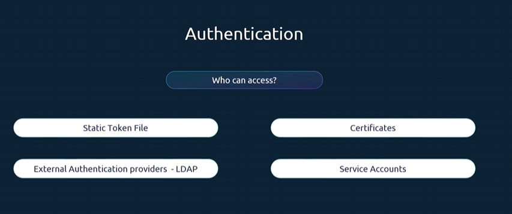
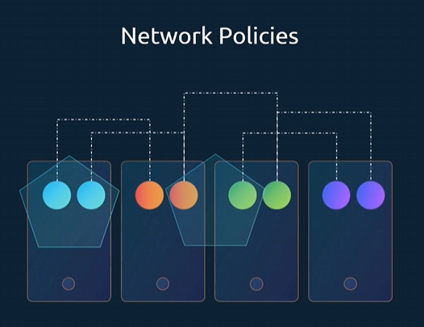

Secure Hosts
- Hosts - host thatform the cluster itself. all the access to the hosts must be secured, root access disabled, password-based authentication disabled, any only ssh key-based authentication.

- The KubeAPI server is at the center of all operations within kubenetes. you can perform almost any operation on the cluster.So thats' the first line of defense.

We have to make two types of decisions , who can access the cluster and what can they do?

Who can access the API server is defined by the authentication mechanisms.

Various ways to auth the API server
- User iDs and Password
- Static files
- Tokens
- Certificates
- Integration with external authentication like LDAP
- For machines we create service accounts.

Once you gain the access to the cluster, what they can do is defined by authorization mechanisms.

Authorization is implemented using role based access controls where users are associated to groups with specfic permission.

Additional Authorized modules like
- Attribute based access control
- webhooks
- Node Authorize

All communication with a cluster between the various components such as the etcd cluster, the Kube Controller Manager, Kube Scheduler, as well as those running on the worker nodes such as the Kubelet and the Kube Proxy is secured using TLS encryption.

Network Policies
- What about communications between applications within the cluster? By default all pods can access all other pods within the cluster. Now you can restrict access between them using netword policies.

