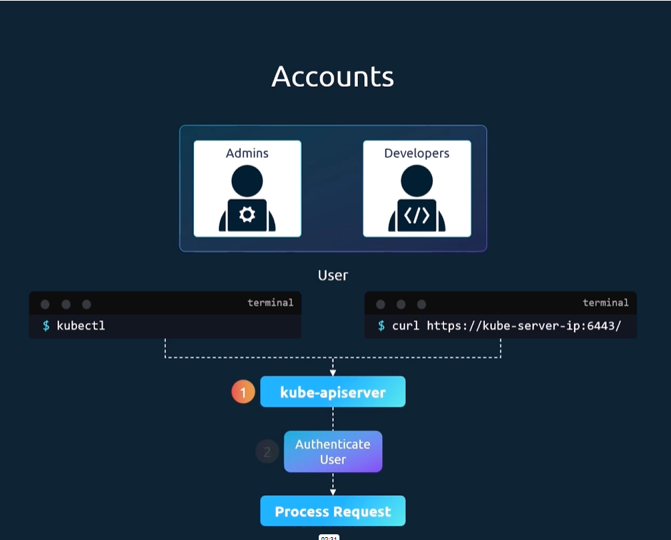

### Authentication

K8s cluster are consiste of multiple nodes physical or virtual and various component that work together.

Thue users like 
- Admin that access the clusters, to perform the administor tasks, 
- Developers that access the clusters, to test or deploy the applications.  
- End Users , who uses the application.
- Third Parties applications for integration purposes.

All user access is managed by the api whether you aessing through Kubectl tool or directly the API.

 

 The kube-apiserver first authenticate then process the request.

So how does the kubeapi authenticates, 
there are different auth mechanism that can be configured.

- Username and token (token file)
- Certificates
- Third parties protocols like LDAP

