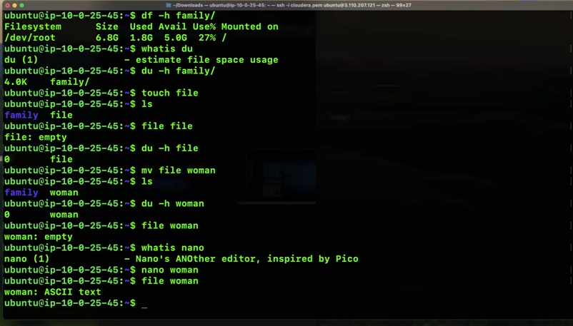

# Commands used in LMS Linux II

GNU.org applications is from gnu
and the kernel is coming from Kernel.org

how many operating system are created?
DistroWatch 

What you are going to make is not a POSIX complaint system using the kernel and GNU.

What is the meaning of POSIX Complaint system?
This gives us a general public license. 

Distro means distribution

what is ls?
pwd  print working directory

whoami
hostname -s
hostname -d

Changing the shell cat /etc/shells

verbose mode
-vvv -v

client and server , server and client?
    Its a software

uname 
uname -o
uname -a (all)
file uname - file needs full path
which uname, 
/usr/bin/uname
its a binary proof executable 
uname -0
uname --operating-system

uname --kernel-release
6.8.0-1016-aws
6 kernel
8 major updates
0 minor updates
1016 distro patch

sudo apt update - "repository"
sudo apt upgrade
sudo do-release-upgrade

what is the different between update,upgrade,release-upgrade.
update - lsb_release -a
04 april
upgrade - only those application which are required
do-release - updagrade the kernel as well

longterm support
5 years support

Phases
Alpha dev are woring
Beta test, 
final, according to dev there are  no bugs, management to decide the date to release
release every year 04/04
stable with longterm support
Obselete
10year or more then its legend, legacy

whoami
hostname
hostname -f difference is it gives the FCDNS

~ home
$ soldier
` backtick

POSIX compliant, how many command are there type a and tab tab it will display all the command.

what do you meaning of freedom?
google browser viewsousce in a browser, apple uses encoding. 

administrative freedom

lsblk
sudo -i
root@userip can delete the system
sudo superuser privileges, provided that is in my id.

what is apt, yum, zipper, dnf to installer, 
apt install tree
tree / 
How many root do you see in the prompt?
root@ip-10-0-25-45:~ tree /
/ File system hirarchy 

In linux everything is just a file.

what is file?

fdisk /dev/xvda To see the freedom

ASCII
Learn linux from linux

du -h file

whatis nano
notepad nano

In the linux file system it occupies a minimum 4kb of space.

ls --inode

man hier

---

Here’s a **summary with headings and subheadings** based on your provided text. The `.png` image references have been kept as **placeholders**.

---

# Summary: Commands and Concepts in LMS Linux II

---

## 1. **Introduction to Linux Systems**

* **Sources of Linux Components**

  * Kernel from: [Kernel.org](https://kernel.org)
  * GNU Tools from: [GNU.org](https://gnu.org)
* **DistroWatch**

  * Platform to explore different Linux distributions.

---

## 2. **POSIX Compliance**

* **POSIX-Compliant System**

  * Not the focus in this learning context.
* **Definition**

  * A standard that provides general public licensing and command compatibility.
* **Freedom in Linux**

  * Open-source freedom includes administrative and user-level flexibility.

---

## 3. **Basic Linux Commands**

* `ls` – List files
* `pwd` – Print working directory
* `whoami` – Show current user
* `hostname -s` – Short hostname
* `hostname -d` – Domain name

---

## 4. **Shell and Verbose Modes**

* **View Available Shells**

  * `cat /etc/shells`
* **Verbose Mode**

  * Add flags like `-v`, `-vv`, or `-vvv` for detailed output

---

## 5. **Client-Server Concept**

* **Definition**

  * Describes a software model (not a physical machine).

---

## 6. **`uname` Command Variants**

* `uname` – Kernel name
* `uname -o` – Operating system
* `uname -a` – All system info
* `file /usr/bin/uname` – Binary file type
* `which uname` – File location
* `uname --kernel-release` – Example: `6.8.0-1016-aws`

  * Breakdown:

    * `6`: Kernel
    * `8`: Major update
    * `0`: Minor update
    * `1016`: Distro patch

---

## 7. **System Updates**

* `sudo apt update` – Updates package list
* `sudo apt upgrade` – Upgrades essential packages
* `sudo do-release-upgrade` – Full system upgrade, includes kernel

### Difference:

* `update` – Refreshes list of available packages
* `upgrade` – Updates current packages
* `release-upgrade` – Kernel and system-wide update

---

## 8. **Linux Lifecycle**

* **Development Phases**

  * Alpha → Beta → Final → Release
* **Release Date**

  * Typically around 04/04 each year
* **Support Terms**

  * LTS: 5 years
  * Obsolete: Over 10 years → Legacy

---

## 9. **Host and File System**

* `hostname -f` – Fully qualified domain name (FQDN)
* `~` – Home directory
* `$ soldier` – Current user prompt
* `` ` `` – Backtick symbol

---

## 10. **Command Discovery & Administrative Freedom**

* **Command Enumeration**

  * Use `type a` + `Tab Tab` for auto-completion
* **Admin Access**

  * `sudo` – Temporary root access
  * `sudo -i` – Login as root shell
  * `root@userIP` – Full access, caution needed

---

## 11. **Package Managers**

* **Common Tools**

  * `apt`, `yum`, `dnf`, `zipper`
* **Installation Example**

  * `apt install tree`
  * `tree /` – Shows file system hierarchy
* **Everything is a File**

  * Linux treats devices, directories, etc., as files.

---

## 12. **File System Tools**

* `lsblk` – Lists block devices
* `fdisk /dev/xvda` – Disk partition view
* `du -h file` – Shows file size in human-readable form
* `ls --inode` – Show inode numbers
* `man hier` – Manual for file system hierarchy

---

## 13. **Text Editors and ASCII**

* **Nano**

  * Text editor similar to Notepad (`whatis nano`)
* **Minimum File Size**

  * Linux file system uses 4KB block allocation

---

## 14. **Learning Approach**

* **"Learn Linux from Linux"**

  * Emphasis on hands-on practice and exploration

---

### 

### 

---

Let me know if you'd like a printable version or slide format of this summary.
